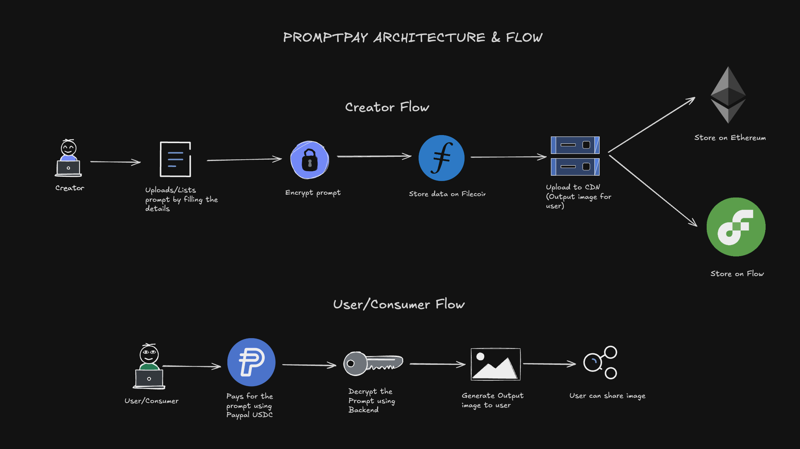

# PromptPay

The first blockchain marketplace for AI prompts. Buy and sell high-quality prompts with instant payments.

## What is PromptPay?

PromptPay connects prompt creators with users who want better AI results. Creators upload their best prompts and earn money when people buy them. Users get access to proven prompts that actually work.

**The Problem:** Great prompt engineers share their work for free while users spend hours trying to recreate viral AI outputs.

**Our Solution:** A marketplace where both sides win.

## Architecture



## Tech Stack

- **Blockchain:** Flow (primary) + Polygon
- **Payments:** PayPal USD (PYUSD)
- **Storage:** Filecoin + IPFS
- **Smart Contracts:** Solidity

## Features

**For Creators:**
- Upload prompts with examples
- Set your own prices
- Get paid instantly in PYUSD
- Track your sales

**For Buyers:**
- Browse by AI model or category
- See real examples before buying
- Pay with stable PYUSD
- Get prompts immediately

## Quick Start

```bash
git clone https://github.com/yourusername/promptpay.git
cd promptpay
npm install
cp .env.example .env
npm run dev
```

## Environment Variables

```
FLOW_NETWORK=testnet
POLYGON_RPC_URL=your_polygon_url
PYUSD_CONTRACT_ADDRESS=your_contract_address
FILECOIN_API_KEY=your_filecoin_key
```

## How It Works

1. **Creators** upload prompts with sample outputs and set prices
2. **Prompts** are encrypted and stored on Filecoin
3. **Buyers** browse, preview, and purchase with PYUSD
4. **Smart contracts** handle payments and unlock prompts instantly

## Why PromptPay?

- **Low fees:** 2.5% vs 30% on app stores
- **Instant payments:** No waiting periods
- **Global access:** Works anywhere
- **Multi-blockchain:** Flow + Polygon support
- **Stable payments:** PYUSD eliminates volatility

## Business Model

- 2.5% fee per transaction
- Premium creator tools
- Enterprise solutions

## Contributing

1. Fork the repo
2. Create a feature branch
3. Make your changes
4. Submit a pull request

## Links

- Website: promptpay.app
- Docs: docs.promptpay.app
- Discord: discord.gg/promptpay

## License

MIT License